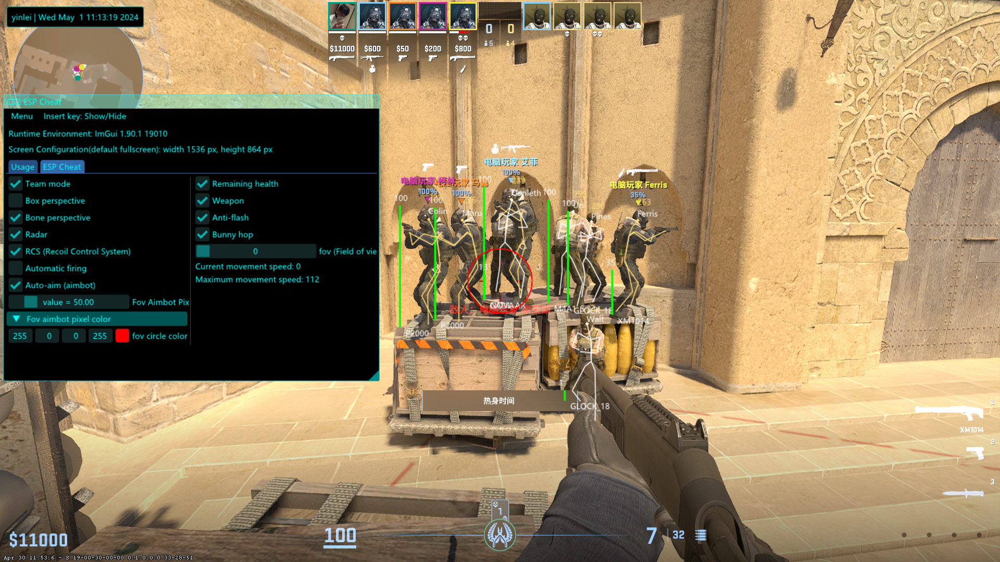

# CS2 ESP Cheat - C++

This is a `CS2 ESP cheat` software written in C++.

> Latest Update：2024.05.01 10:50

## Features

- 方框透视
- 骨骼透视
- 自瞄锁头
- 枪后座力补偿
- 连跳
- 防闪光弹
- 地图扫描敌人雷达
- 敌人雷达与墙体遮挡的可见性检测
- 实时显示玩家剩余血条、名字、距离、持有的武器等信息
- 玩家视野角度超广角
- 绕过VAC反作弊系统(用户模式句柄劫持，非DMA和内核)

## Download

See [Releases page](https://github.com/yinleiCoder/cs2-cheat-cpp/releases)  for decorated Changelogs. Reading the changelogs is a good way to keep up to date with the things `CS2CheatCPP` has to offer, and maybe will give you ideas of some features that you've been ignoring until now!

## Usage

1. 确保您的windows电脑上安装了`Directx` - 因为cs2游戏使用的是[directx 11](https://www.pcgamingwiki.com/wiki/Counter-Strike_2)
2. 打开`CS2`游戏，并进入游戏房间
3. 进入游戏房间后，此时鼠标双击`CS2CheatCpp.exe`运行外挂程序
4. 运行外挂程序后，会显示外挂程序菜单，可以按`Insert键`进行显示/隐藏
5. 若没有显示外挂程序菜单，则请提交日志文件记录 - 多数可能为offsets与CS2官方更新不同步，可clone代码后自行构建
6. 【可选操作】每局结束后，建议先退出外挂程序，等到再次进入游戏房间后重复上述步骤 - 因为`句柄劫持`有时候效果不是非常好，至少我目前没有被封过

## Build

- Change **LAUNCH OPTIONS**  with `-insecure` mode
- VisualStudio 2022
	- `Release` and Platform target `x64` because cs2 platform
	- Character Set `Use Multi-Byte Character Set`
	- Linker->Additional Dependencies `d3d11.lib`
	- Linker->System->SubSystem `Windows(/SUBSYSTEM:WINDOWS)`
	- VC++ Directories->Include Directories `dependencies/ImGui`
- Offsets:
	- [offsets](https://github.com/a2x/cs2-dumper/blob/main/output/offsets.hpp)
	- [client.dll](https://github.com/a2x/cs2-dumper/blob/main/output/client.dll.hpp)
	- [buttons](https://github.com/a2x/cs2-dumper/blob/main/output/buttons.hpp)
- Packages:
	- [ImGui](https://github.com/ocornut/imgui)
	- [source2sdk](https://github.com/neverlosecc/source2sdk/tree/cs2/sdk)
- [Visual Key Code](https://learn.microsoft.com/en-us/windows/win32/inputdev/virtual-key-codes)
- [unknowncheats](https://www.unknowncheats.me/forum/index.php)
- [guidedhacking](https://guidedhacking.com/)
- [句柄劫持绕过反作弊系统](https://github.com/Apxaey/Handle-Hijacking-Anti-Cheat-Bypass)

## Star History

<a href="https://star-history.com/#yinleiCoder/cs2-cheat-cpp">
 <picture>
   <source media="(prefers-color-scheme: dark)" srcset="https://api.star-history.com/svg?repos=yinleiCoder/cs2-cheat-cpp&theme=dark" />
   <source media="(prefers-color-scheme: light)" srcset="https://api.star-history.com/svg?repos=yinleiCoder/cs2-cheat-cpp" />
   
 </picture>
</a>

## Thanks

I am working on [CS2 Internal Cheat With ImGui Hook](https://github.com/yinleiCoder/cs2-cheat-internal) project，Welcome to star!!!

请我喝杯咖啡？我正在编写`cs2内部外挂`，实现诸如换肤器等功能，感谢您的支持：

